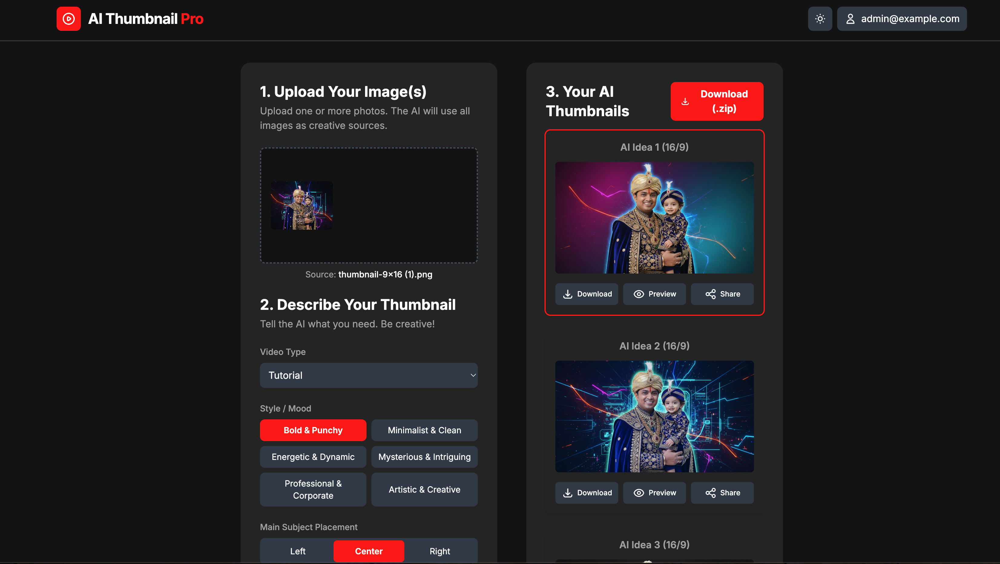

# 🎨 AI Thumbnail Pro

> Create stunning YouTube thumbnails with AI-powered image editing using Google's Gemini 2.5 Flash

**🚀 [Try it Live](https://ai-thumbnail-pro-2-g2461y0pr-atish-maskes-projects.vercel.app)**



## ✨ Features

- 🖼️ **Smart Image Upload** - Upload multiple images as creative sources
- 🎯 **Intelligent Questionnaire** - AI analyzes your video type and style preferences
- 🎨 **Multiple Style Options** - Bold & Punchy, Minimalist, Energetic, Professional, and more
- 🔄 **AI-Generated Variations** - Get 3 unique thumbnail ideas per generation
- 📱 **Responsive Design** - Works perfectly on desktop and mobile
- ⚡ **Real-time Preview** - Instant preview and download options
- 🎭 **Subject Placement Control** - Choose where your main subject appears

## 🚀 Quick Start

### Prerequisites
- Node.js 18+ 
- Google Gemini API key ([Get one here](https://ai.google.dev/))

### Installation

1. **Clone the repository**
   ```bash
   git clone git@github.com:atish23/AI-Thumbnail-Pro.git
   cd AI-Thumbnail-Pro
   ```

2. **Install dependencies**
   ```bash
   npm install
   ```

3. **Set up environment variables**
   ```bash
   cp .env.example .env.local
   ```
   Edit `.env.local` and add your Gemini API key:
   ```bash
   GEMINI_API_KEY=your_actual_api_key_here
   ```

4. **Run the development server**
   ```bash
   npm run dev
   ```

5. **Open your browser**
   Navigate to [http://localhost:5173](http://localhost:5173)

## 🔧 Environment Setup

Create a `.env.local` file in the root directory:

```env
GEMINI_API_KEY=your_gemini_api_key_here
```

Get your API key from [Google AI Studio](https://ai.google.dev/).

## 🧪 Testing

Test your API configuration:

```bash
node test-api.js
```

This will verify:
- ✅ API key validity
- ✅ Gemini AI connection
- ✅ Text generation capability
- ✅ Image editing model access

## 📱 How to Use

1. **Upload Images**: Add one or more photos that will serve as your creative sources
2. **Answer Questions**: Fill out the questionnaire about your video type and style preferences
3. **Generate Thumbnails**: Click "Generate Thumbnails" to create AI-powered variations
4. **Download**: Preview and download your favorite thumbnails

## 🛠️ Tech Stack

- **Frontend**: React 19 + TypeScript + Vite
- **AI Model**: Google Gemini 2.5 Flash Image Preview
- **Styling**: Modern CSS with responsive design
- **Deployment**: Ready for Vercel deployment

## 📦 Available Scripts

- `npm run dev` - Start development server
- `npm run build` - Build for production
- `npm run preview` - Preview production build

## 🚀 Deployment

### Deploy to Vercel

1. **Install Vercel CLI** (if not already installed)
   ```bash
   npm i -g vercel
   ```

2. **Deploy**
   ```bash
   vercel
   ```

3. **Set Environment Variables**
   In your Vercel dashboard, add:
   - `GEMINI_API_KEY`: Your Google Gemini API key

### Alternative: Deploy via GitHub

1. Push your code to GitHub
2. Connect your repository to Vercel
3. Add environment variables in Vercel dashboard
4. Deploy automatically on every push

## 🔍 Project Structure

```
ai-thumbnail-pro/
├── components/          # React components
│   ├── Chat.tsx        # Chat interface
│   ├── FileUpload.tsx  # File upload component
│   ├── Header.tsx      # App header
│   ├── Questionnaire.tsx # Style questionnaire
│   └── ThumbnailCard.tsx # Thumbnail display
├── services/           # API services
│   ├── geminiService.ts # Gemini AI integration
│   ├── imageService.ts # Image processing
│   └── promptService.ts # Prompt enhancement
├── assets/             # Static assets
└── test-api.js         # API testing script
```

## 🎯 AI Models Used

- **Text Generation**: `gemini-2.0-flash-exp`
- **Image Editing**: `gemini-2.5-flash-image-preview`

## 🤝 Contributing

1. Fork the repository
2. Create your feature branch (`git checkout -b feature/amazing-feature`)
3. Commit your changes (`git commit -m 'Add amazing feature'`)
4. Push to the branch (`git push origin feature/amazing-feature`)
5. Open a Pull Request

## 📄 License

This project is licensed under the MIT License.

## 🔗 Links

- **🚀 Live Demo**: https://ai-thumbnail-pro-2-g2461y0pr-atish-maskes-projects.vercel.app
- **AI Studio**: https://ai.studio/apps/drive/1L9jOZ2_Y_2R0l4P31Kbl09L5oJBv-jwl
- **Google AI Studio**: https://ai.google.dev/

---

<div align="center">
Made with ❤️ using Google's Gemini AI
</div>

